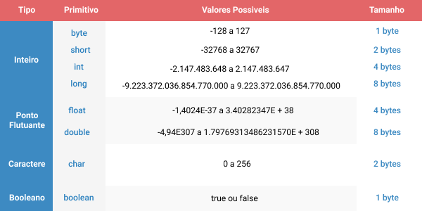

# Ponteiros
Para muitas pessoas ponteiros são de arrepiar os cabelos... Eles são um pouco complexos mas o básico deles é simples de entender.

Um ponteiro é quando você reserva uma posição de memória que armazena uma quantidade de bytes relativo a cada tipo.

>Imagem retirada do repositório do <a href="github.com/hellowluan/">hellowluan</a>



Cada tipo de variável tem um gasto na memória RAM do seu computador, um ponteiro armazena um tamanho necessário para receber esse tipo. O ponteiro contém o endereço de memória que foi reservado para fazer sua alocação.

Assim como as funções do **<stdio.h>**, para manipular ponteiros e realizar alocação dinâmica é necessário utilizar o header **<stdlib.h>**.

Exemplo inicial:

```c
#include <stdio.h>
#include <stdlib.h>

int main(void) {

    int valor = 30;

    int *ponteiro; //para declarar um ponteiro é seu tipo e o nome como asterisco atrás dele.

    ponteiro = &valor; //como o ponteiro armazena o endereço de memória, para passar o valor da variável para ele deve-se passar seu endereço.

    printf("Variável valor: %d, Ponteiro: %d\n", valor, *ponteiro);
    //imprime 
    //Variável valor: 30, Ponteiro: 30

    //Se remover o "*" do ponteiro e alterar o formatação, será exibido o endereço do ponteiro na memória
    printf("Endereço do ponteiro na memória: %p\n", ponteiro);

}
```

É possível também reservar uma parte da memória sem passar uma variável para o ponteiro. É utilizada a função malloc com a sizeof.

```c
#include <stdio.h>
#include <stdlib.h>

int main(void) {

    int *ponteiro; //para declarar um ponteiro é seu tipo e o nome como asterisco atrás dele.

    ponteiro = malloc(sizeof(int));
    //a função malloc armazena na memória o tamanho em bytes que você quiser.
    //a função sizeof retorna o tamanho do tipo que você quer, portanto o ponteiro fica alocado corretamente para o tamanho indicado e está pronto para uso.

    //como um ponteiro já é um endereço de memória
    //não é necessário utilizar o "&", como é feito normalmente
    scanf("%d", ponteiro);
    printf("%d\n", *ponteiro);

}
```

Má prática com ponteiros:
```c
#include <stdio.h>
#include <stdlib.h>

int main(void) {

    int *ponteiro; //para declarar um ponteiro é seu tipo e o nome como asterisco atrás dele.

    ponteiro = malloc(sizeof(int));

    //esse código funciona mas não é adequado
    //ao compilar o compilador dá diversos warning(avisos)
    //pois os tipos das variáveis não é o mesmo da formatação
    //podendo resultar em ações indesejadas
    scanf("%d", &ponteiro);
    printf("%d\n", ponteiro);

}
```

Maiores explicações sobre C:

<a href="https://www.embarcados.com.br/ponteiro-em-c-alocacao-dinamica/">Embarcados</a>

<a href="https://www.ime.usp.br/~pf/algoritmos/aulas/aloca.html">USP</a>


